## 1. 同步 flash-attention
 - 说明：TMA、GEMM、Softmax 同步执行，未开启异步特性，分别测量各部分所消耗的时间
 - 测试方式：预热10次，执行100次，取均值，仅允许第一个block的第一个线程进行即时修改全局计时变量profile
 - 变量：BM、BN 为 tile 大小
 - 注意：**大于128/128的tile汇编器报警告了，可能该变了wgmma的指令执行，gemm值可能偏大**
 - 备注：数据更新于2026.6.3，测量方式修改为每次迭代记录周期时间戳，出kernel后再做计算，且每次迭代都存储在不同数组中。
 - 结果：

### shape: B = 1, H = 16, S = 4096, D = 128

| BM | BN | LoadQ(avg) | LoadK(avg) | LoadV(avg) | GEMM-QK(avg) | SOFTMAX(avg) | GEMM-PV(avg) |
| ---: | ---: | ---: | ---: | ---: | ---: | ---: | ---: |
| 128 | 32 | 1208.03 | 777.29 | 500.28 | 406.75 | 739.91 | 277.00 |
| 128 | 64 | 1217.59 | 690.25 | 555.52 | 507.10 | 840.41 | 526.00 |
| 128 | 128 | 1220.27 | 765.28 | 728.63 | 1045.34 | 1355.75 | 1045.03 |
| 128 | 256 | 1215.30 | 1065.24 | 1039.52 | 2046.45 | 2455.75 | 2058.06 |
| 256 | 32 | 1381.36 | 784.41 | 459.59 | 1033.97 | 984.51 | 538.00 |
| 256 | 64 | 1397.98 | 733.83 | 543.98 | 1344.27 | 1573.07 | 1045.01 |
| 256 | 128 | 1409.39 | 844.00 | 830.30 | 2429.31 | 5040.72 | 3828.36 |

### shape: B = 1, H = 16, S = 4096, D = 64

| BM | BN | LoadQ(avg) | LoadK(avg) | LoadV(avg) | GEMM-QK(avg) | SOFTMAX(avg) | GEMM-PV(avg) |
| ---: | ---: | ---: | ---: | ---: | ---: | ---: | ---: |
| 128 | 32 | 615.06 | 463.38 | 427.58 | 233.03 | 682.69 | 168.00 |
| 128 | 64 | 615.11 | 500.15 | 475.93 | 285.09 | 943.66 | 261.00 |
| 128 | 128 | 616.35 | 553.74 | 543.87 | 527.90 | 1332.06 | 531.03 |
| 128 | 256 | 616.64 | 720.79 | 686.94 | 1144.94 | 2636.82 | 1043.08 |
| 256 | 32 | 768.65 | 451.85 | 436.45 | 552.34 | 872.65 | 268.00 |
| 256 | 64 | 770.71 | 490.29 | 462.49 | 745.97 | 1495.50 | 541.00 |
| 256 | 128 | 773.05 | 595.32 | 550.13 | 1222.74 | 2734.72 | 1073.03 |

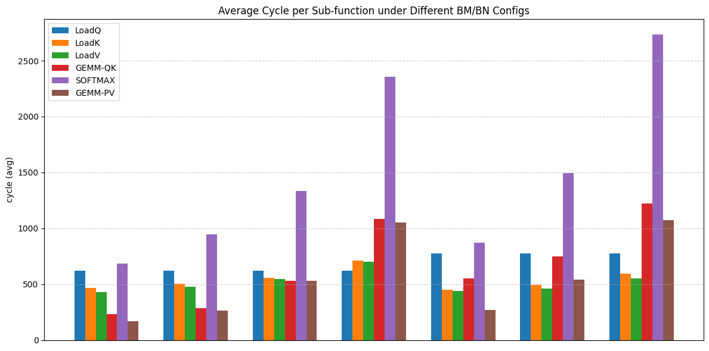

### 将MMA_N的最大值限制为128

```c++
  // WGMMA指令计算size的设置方式
  constexpr int MMA_M = 64;
  constexpr int QK_MMA_N = BN <= 128 ? BN : 128;    // QK
  constexpr int PV_MMA_N = DIM <= 128 ? DIM : 128;  // PV
  constexpr int MMA_K = 16;
```
#### shape: B = 1, H = 16, S = 4096, D = 128

| BM | BN | LoadQ(avg) | LoadK(avg) | LoadV(avg) | GEMM-QK(avg) | SOFTMAX(avg) | GEMM-PV(avg) |
| ---: | ---: | ---: | ---: | ---: | ---: | ---: | ---: |
| 128 | 32 | 615.06 | 463.38 | 427.58 | 233.03 | 682.69 | 168.00 |
| 128 | 64 | 615.11 | 500.15 | 475.93 | 285.09 | 943.66 | 261.00 |
| 128 | 128 | 616.35 | 553.74 | 543.87 | 527.90 | 1332.06 | 531.03 |
| 128 | 256 | 616.64 | 720.79 | 686.94 | 1144.94 | 2636.82 | 1043.08 |
| 256 | 32 | 768.65 | 451.85 | 436.45 | 552.34 | 872.65 | 268.00 |
| 256 | 64 | 770.71 | 490.29 | 462.49 | 745.97 | 1495.50 | 541.00 |
| 256 | 128 | 773.05 | 595.32 | 550.13 | 1222.74 | 2734.72 | 1073.03 |

#### shape: B = 1, H = 16, S = 4096, D = 64

| BM | BN | LoadQ(avg) | LoadK(avg) | LoadV(avg) | GEMM-QK(avg) | SOFTMAX(avg) | GEMM-PV(avg) |
| ---: | ---: | ---: | ---: | ---: | ---: | ---: | ---: |
| 128 | 32 | 1220.13 | 815.68 | 465.29 | 406.75 | 739.85 | 277.00 |
| 128 | 64 | 1205.70 | 693.62 | 555.10 | 507.11 | 840.32 | 526.00 |
| 128 | 128 | 1211.74 | 776.94 | 728.65 | 1045.34 | 1355.73 | 1045.03 |
| 128 | 256 | 1212.17 | 1091.15 | 1018.32 | 2114.64 | 2590.88 | 2050.29 |
| 256 | 32 | 1437.71 | 779.05 | 460.98 | 1033.38 | 984.62 | 538.00 |
| 256 | 64 | 1445.23 | 739.05 | 544.50 | 1344.27 | 1573.19 | 1045.01 |
| 256 | 128 | 1439.68 | 903.77 | 886.04 | 2429.71 | 5045.84 | 3846.62 |


## 2. WS 模式下测量QKV的TMA Load
 - 说明：仅仅测量TMA在WS模式下的时间开销，xxx_rel是相对原点的周期数（用于刻画时间轴体现重叠）
 - 测试方式：预热10次，执行100次，取均值，仅允许第一个block的第一个线程进行即时修改全局计时变量profile
 - 变量：BM、BN 为 tile 大小
 - 注意：**TMA为独立于SM的硬件，所有的SM都需要通过相同TMA硬件加载数据，因此block多TMA压力越大，且该测试无计算进行分散TMA指令的发射**
 - 备注：原始数据采用的shape：B = 1, H = 1, S = 512, D = 128，block开得很少，TMA压力小，所以时间应该是准确的。
 - 结果：

 ### BM = 128, BN = 32

| op | slot | start_abs | end_abs | start_rel | end_rel | cycles |
| --- | ---: | ---: | ---: | ---: | ---: | ---: |
| Q | 0 | 9928 | 810 | 0 | 882 | 882 |
| K | 0 | 231 | 985 | 303 | 1057 | 754 |
| V | 0 | 414 | 1109 | 486 | 1181 | 695 |
| K | 1 | 1126 | 1576 | 1198 | 1648 | 450 |
| V | 1 | 1278 | 1712 | 1350 | 1784 | 434 |
| K | 2 | 1734 | 2184 | 1806 | 2256 | 450 |
| V | 2 | 1879 | 2320 | 1951 | 2392 | 441 |
| K | 3 | 2344 | 2808 | 2416 | 2880 | 464 |
| V | 3 | 2504 | 2944 | 2576 | 3016 | 440 |
| K | 4 | 2967 | 3434 | 3039 | 3506 | 467 |
| V | 4 | 3127 | 3570 | 3199 | 3642 | 443 |
| K | 5 | 3593 | 4060 | 3665 | 4132 | 467 |
| V | 5 | 3754 | 4196 | 3826 | 4268 | 442 |
| K | 6 | 4219 | 4679 | 4291 | 4751 | 460 |
| V | 6 | 4379 | 4815 | 4451 | 4887 | 436 |
| K | 7 | 4839 | 5302 | 4911 | 5374 | 463 |
| V | 7 | 4999 | 5438 | 5071 | 5510 | 439 |
| K | 8 | 5461 | 5926 | 5533 | 5998 | 465 |
| V | 8 | 5622 | 6062 | 5694 | 6134 | 440 |
| K | 9 | 6085 | 6547 | 6157 | 6619 | 462 |
| V | 9 | 6245 | 6683 | 6317 | 6755 | 438 |
| K | 10 | 6706 | 7168 | 6778 | 7240 | 462 |
| V | 10 | 6862 | 7304 | 6934 | 7376 | 442 |
| K | 11 | 7328 | 7793 | 7400 | 7865 | 465 |
| V | 11 | 7488 | 7929 | 7560 | 8001 | 441 |
| K | 12 | 7951 | 8406 | 8023 | 8478 | 455 |
| V | 12 | 8096 | 8542 | 8168 | 8614 | 446 |
| K | 13 | 8565 | 9032 | 8637 | 9104 | 467 |
| V | 13 | 8726 | 9168 | 8798 | 9240 | 442 |
| K | 14 | 9192 | 9657 | 9264 | 9729 | 465 |
| V | 14 | 9352 | 9793 | 9424 | 9865 | 441 |
| K | 15 | 9817 | 280 | 9889 | 10352 | 463 |
| V | 15 | 9977 | 411 | 10049 | 10483 | 434 |

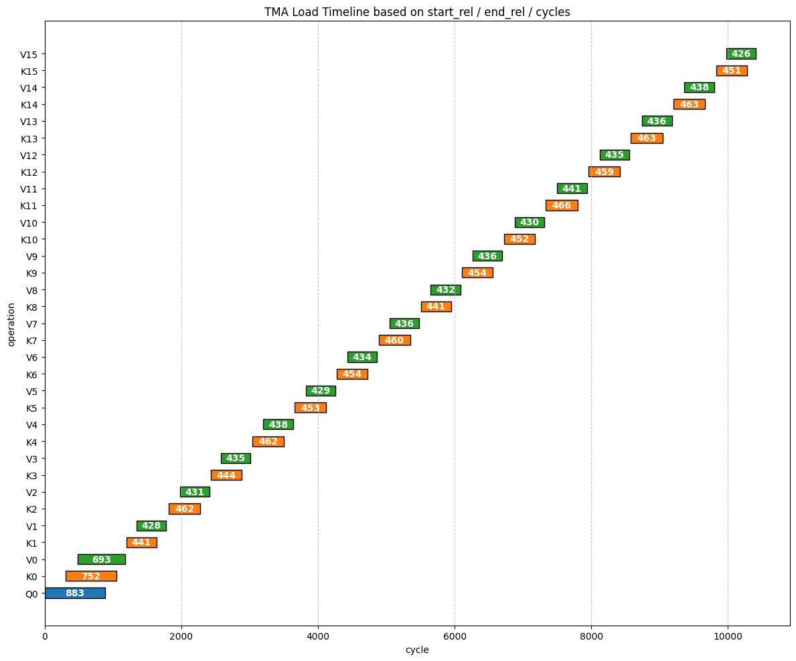

### BM = 128, BN = 64

| op | slot | start_abs | end_abs | start_rel | end_rel | cycles |
| --- | ---: | ---: | ---: | ---: | ---: | ---: |
| Q | 0 | 3595 | 4487 | 0 | 892 | 892 |
| K | 0 | 3899 | 4660 | 304 | 1065 | 761 |
| V | 0 | 4082 | 4788 | 487 | 1193 | 706 |
| K | 1 | 4811 | 5364 | 1216 | 1769 | 553 |
| V | 1 | 4965 | 5502 | 1370 | 1907 | 537 |
| K | 2 | 5525 | 6099 | 1930 | 2504 | 574 |
| V | 2 | 5686 | 6235 | 2091 | 2640 | 549 |
| K | 3 | 6258 | 6813 | 2663 | 3218 | 555 |
| V | 3 | 6418 | 6949 | 2823 | 3354 | 531 |
| K | 4 | 6972 | 7545 | 3377 | 3950 | 573 |
| V | 4 | 7135 | 7683 | 3540 | 4088 | 548 |
| K | 5 | 7706 | 8260 | 4111 | 4665 | 554 |
| V | 5 | 7866 | 8398 | 4271 | 4803 | 532 |
| K | 6 | 8420 | 8985 | 4825 | 5390 | 565 |
| V | 6 | 8565 | 9121 | 4970 | 5526 | 556 |
| K | 7 | 9144 | 9710 | 5549 | 6115 | 566 |
| V | 7 | 9305 | 9841 | 5710 | 6246 | 536 |

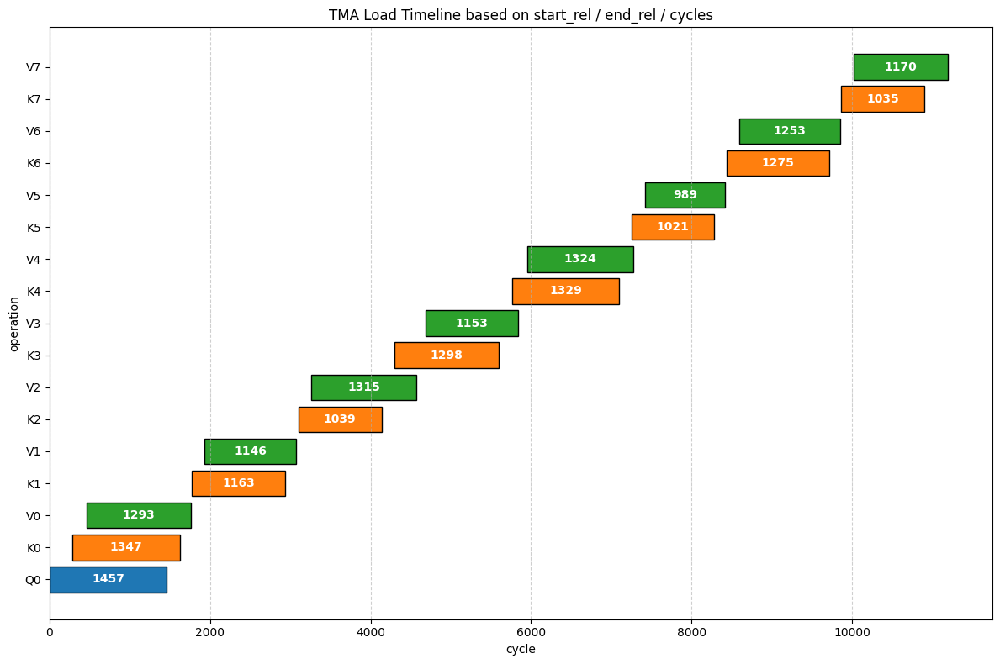

### BM = 128, BN = 128

| op | slot | start_abs | end_abs | start_rel | end_rel | cycles |
| --- | ---: | ---: | ---: | ---: | ---: | ---: |
| Q | 0 | 5501 | 6362 | 0 | 861 | 861 |
| K | 0 | 5805 | 6684 | 304 | 1183 | 879 |
| V | 0 | 5988 | 6893 | 487 | 1392 | 905 |
| K | 1 | 6847 | 7550 | 1346 | 2049 | 703 |
| V | 1 | 7003 | 7816 | 1502 | 2315 | 813 |
| K | 2 | 7713 | 8396 | 2212 | 2895 | 683 |
| V | 2 | 7927 | 8666 | 2426 | 3165 | 739 |
| K | 3 | 8559 | 9301 | 3058 | 3800 | 742 |
| V | 3 | 8777 | 9531 | 3276 | 4030 | 754 |

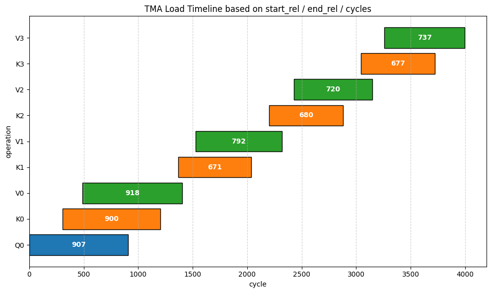

### BM = 128, BN = 256

| op | slot | start_abs | end_abs | start_rel | end_rel | cycles |
| --- | ---: | ---: | ---: | ---: | ---: | ---: |
| Q | 0 | 6421 | 7319 | 0 | 898 | 898 |
| K | 0 | 6725 | 7991 | 304 | 1570 | 1266 |
| V | 0 | 6908 | 8421 | 487 | 2000 | 1513 |
| K | 1 | 8154 | 9188 | 1733 | 2767 | 1034 |
| V | 1 | 8532 | 9722 | 2111 | 3301 | 1190 |

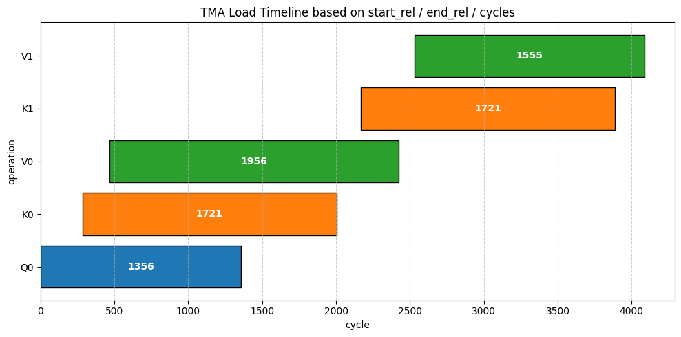

### BM = 256, BN = 32

| op | slot | start_abs | end_abs | start_rel | end_rel | cycles |
| --- | ---: | ---: | ---: | ---: | ---: | ---: |
| Q | 0 | 6739 | 7915 | 0 | 1176 | 1176 |
| K | 0 | 7043 | 8092 | 304 | 1353 | 1049 |
| V | 0 | 7226 | 8216 | 487 | 1477 | 990 |
| K | 1 | 8233 | 8686 | 1494 | 1947 | 453 |
| V | 1 | 8385 | 8822 | 1646 | 2083 | 437 |
| K | 2 | 8846 | 9307 | 2107 | 2568 | 461 |
| V | 2 | 9006 | 9443 | 2267 | 2704 | 437 |
| K | 3 | 9467 | 9930 | 2728 | 3191 | 463 |
| V | 3 | 9627 | 66 | 2888 | 3327 | 439 |
| K | 4 | 88 | 540 | 3349 | 3801 | 452 |
| V | 4 | 233 | 676 | 3494 | 3937 | 443 |
| K | 5 | 699 | 1162 | 3960 | 4423 | 463 |
| V | 5 | 859 | 1298 | 4120 | 4559 | 439 |
| K | 6 | 1321 | 1782 | 4582 | 5043 | 461 |
| V | 6 | 1482 | 1918 | 4743 | 5179 | 436 |
| K | 7 | 1942 | 2408 | 5203 | 5669 | 466 |
| V | 7 | 2102 | 2544 | 5363 | 5805 | 442 |
| K | 8 | 2567 | 3032 | 5828 | 6293 | 465 |
| V | 8 | 2728 | 3168 | 5989 | 6429 | 440 |
| K | 9 | 3191 | 3658 | 6452 | 6919 | 467 |
| V | 9 | 3352 | 3794 | 6613 | 7055 | 442 |
| K | 10 | 3817 | 4281 | 7078 | 7542 | 464 |
| V | 10 | 3978 | 4417 | 7239 | 7678 | 439 |
| K | 11 | 4440 | 4905 | 7701 | 8166 | 465 |
| V | 11 | 4601 | 5041 | 7862 | 8302 | 440 |
| K | 12 | 5064 | 5530 | 8325 | 8791 | 466 |
| V | 12 | 5225 | 5666 | 8486 | 8927 | 441 |
| K | 13 | 5689 | 6153 | 8950 | 9414 | 464 |
| V | 13 | 5850 | 6289 | 9111 | 9550 | 439 |
| K | 14 | 6312 | 6779 | 9573 | 10040 | 467 |
| V | 14 | 6473 | 6915 | 9734 | 10176 | 442 |
| K | 15 | 6938 | 7404 | 10199 | 10665 | 466 |
| V | 15 | 7099 | 7535 | 10360 | 10796 | 436 |

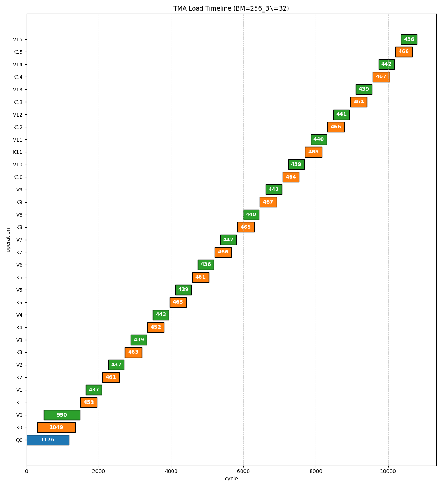

### BM = 256, BN = 64

| op | slot | start_abs | end_abs | start_rel | end_rel | cycles |
| --- | ---: | ---: | ---: | ---: | ---: | ---: |
| Q | 0 | 8251 | 9458 | 0 | 1207 | 1207 |
| K | 0 | 8555 | 9631 | 304 | 1380 | 1076 |
| V | 0 | 8738 | 9755 | 487 | 1504 | 1017 |
| K | 1 | 9772 | 329 | 1521 | 2078 | 557 |
| V | 1 | 9924 | 465 | 1673 | 2214 | 541 |
| K | 2 | 488 | 1048 | 2237 | 2797 | 560 |
| V | 2 | 649 | 1186 | 2398 | 2935 | 537 |
| K | 3 | 1210 | 1771 | 2959 | 3520 | 561 |
| V | 3 | 1370 | 1909 | 3119 | 3658 | 539 |
| K | 4 | 1931 | 2488 | 3680 | 4237 | 557 |
| V | 4 | 2076 | 2624 | 3825 | 4373 | 548 |
| K | 5 | 2647 | 3206 | 4396 | 4955 | 559 |
| V | 5 | 2808 | 3342 | 4557 | 5091 | 534 |
| K | 6 | 3364 | 3902 | 5113 | 5651 | 538 |
| V | 6 | 3509 | 4040 | 5258 | 5789 | 531 |
| K | 7 | 4063 | 4618 | 5812 | 6367 | 555 |
| V | 7 | 4224 | 4751 | 5973 | 6500 | 527 |

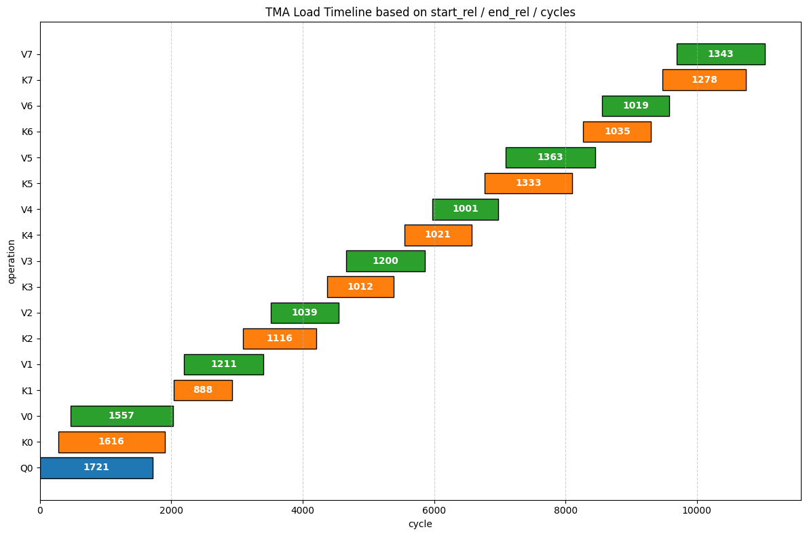

### BM = 256, BN = 128

| op | slot | start_abs | end_abs | start_rel | end_rel | cycles |
| --- | ---: | ---: | ---: | ---: | ---: | ---: |
| Q | 0 | 5842 | 7049 | 0 | 1207 | 1207 |
| K | 0 | 6146 | 7369 | 304 | 1527 | 1223 |
| V | 0 | 6329 | 7528 | 487 | 1686 | 1199 |
| K | 1 | 7532 | 8284 | 1690 | 2442 | 752 |
| V | 1 | 7697 | 8531 | 1855 | 2689 | 834 |
| K | 2 | 8447 | 9144 | 2605 | 3302 | 697 |
| V | 2 | 8638 | 9399 | 2796 | 3557 | 761 |
| K | 3 | 9307 | 9995 | 3465 | 4153 | 688 |
| V | 3 | 9506 | 263 | 3664 | 4421 | 757 |

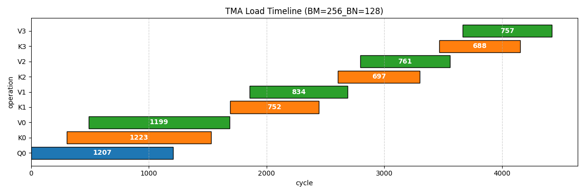
 
 
### 对 B=1, H=16, S=4096, D=64/128 进行的WMA cycle测试

[TMA—WS模式下shape=(B=1, H=16, S=4096, D=64/128)的QKV加载cycle数据](tma_ws.md "TMA—WS模式下的QKV加载cycle数据")

&emsp;&emsp;由于这个表太长，没有再画图展示了，但是值得注意的点是，TMA是所有的SM计算所需的数据都来源于它，所以随着我增大shape，它的block数量也随之增大，这样导致TMA的压力变大，从而导致各个load的cycle增大且不稳定，且中间无计算操作，导致tma时刻都处于load中，tma硬件单元达到带宽上限了。表中的迭代次数为：seq/bn。

&emsp;&emsp;我认为正常的kernel执行，其tma的cycle应该小于上述的数据，但是大于原始测量的数据，因为原始测量虽然没有计算，但是tma远远不可能达到带宽的上限，但是如果存在计算，则会分散tma指令的发射，不至于让tma的cycle达到像上述数据所展示的那么长。

&emsp;&emsp;总结，TMA的cycle应该处于原始数据于新数据之间，解释如上述所说。


## 3.FA3的Num_Buffer和Num_Stage可调整

### 测试 shape=(1, 16, 4096, 64) tile=(128, 128)含 NCU 测量的计算/访存吞吐

| name | smem | stage | time(ms) | tflops | SM Throughput | Mem Throughput | L2 Cache Rate(%) | Theoretical Occupancy(%) | Achieved Occupancy(%) | 
| --- | --- | ---: | ---: | ---: | ---: | ---: | ---: | ---: | ---: |
| K1 | 1 | 1 | 0.319 | 215.086 | 40.22 | 22.90 | 87.64 | 18.75 | 13.92 |
| K2 | 2 | 1 | 0.242 | 283.750 | 50.65 | 27.86 | 81.00 | 18.75 | 13.86 |
| K3 | 2 | 2 | 0.231 | 296.931 | 53.61 | 28.81 | 92.43 | 18.75 | 13.90 |
| K4 | 3 | 2 | 0.239 | 288.102 | 52.87 | 28.35 | 85.11 | 18.75 | 13.86 |

&emsp;&emsp;结合吞吐率、缓存命中率和 occupancy 信息来看，这组实验可以总结为：当前 kernel 的性能提升主要来自 producer-consumer 流水线重叠程度的改善，而不是 occupancy 提升或全局内存带宽提升。K1 使用 num_smem=1, num_stage=1 时，执行时间为 0.319 ms，性能只有 215.086 TFLOPS，SM Throughput 为 40.22%，Mem Throughput 为 22.90%，说明此时计算单元和内存子系统的利用率都不高，kernel 很可能存在明显的 load/compute 串行等待；由于只有一个 shared memory buffer，producer 加载下一块数据和 consumer 使用当前数据进行 WGMMA 计算之间难以重叠，导致 SM 上虽然有 active warp，但很多时候 warp 处于等待 TMA、barrier 或 WGMMA 数据依赖的状态，计算管线没有被充分填满。

&emsp;&emsp;当配置变为 K2，即 num_smem=2, num_stage=1 后，时间从 0.319 ms 降到 0.242 ms，TFLOPS 从 215.086 提升到 283.750，提升约 31.9%；同时 SM Throughput 从 40.22% 提升到 50.65%，Mem Throughput 从 22.90% 提升到 27.86%。这说明双 shared memory buffer 显著改善了数据加载和计算之间的重叠：一个 buffer 可以供 consumer 执行 WGMMA，另一个 buffer 则由 producer 提前加载下一阶段数据，从而减少 consumer 等待数据的时间。这里 Mem Throughput 也有所上升，但绝对值仍然只有 27.86%，并不高，说明性能提升并不是因为打满了内存带宽，而是因为流水线更顺畅，使得 SM 计算单元能够更持续地工作。

&emsp;&emsp;进一步看 K3，num_smem=2, num_stage=2 时，时间继续下降到 0.231 ms，性能达到 296.931 TFLOPS，是四组配置中最高的；SM Throughput 提升到 53.61%，Mem Throughput 提升到 28.81%，L2 Cache Rate 也达到最高的 92.43%。这说明在双 buffer 已经解决主要数据供给问题之后，增加 WGMMA pipeline stage 仍然可以进一步隐藏一部分异步计算、同步或数据准备延迟，使得 WGMMA 指令流更加连续，SM 利用率进一步提高。不过 K2 到 K3 的提升幅度只有约 4.6%，明显小于 K1 到 K2，说明主要瓶颈已经通过双 buffer 得到缓解，增加 stage 只是进一步优化局部流水线效率。

&emsp;&emsp;而 K4 使用 num_smem=3, num_stage=2 后，性能反而下降：时间从 K3 的 0.231 ms 增加到 0.239 ms，TFLOPS 从 296.931 降到 288.102，SM Throughput 也从 53.61% 降到 52.87%，Mem Throughput 从 28.81% 略降到 28.35%，L2 Cache Rate 也从 92.43% 降到 85.11%。这说明继续增加 shared memory buffer 到 3 并没有带来更有效的 load/compute overlap，反而引入了额外开销，例如更多 shared memory 占用、更复杂的 buffer index 轮转、mbarrier 管理、地址计算以及可能更长的寄存器 live range。由于当前 Mem Throughput 本身并不高，全局内存或 L2 带宽并不是主要瓶颈，因此增加更多 smem buffer 无法带来明显收益。

&emsp;&emsp;另外，四组实验的 Theoretical Occupancy 都是 18.75%，Achieved Occupancy 也几乎保持在 13.86% 到 13.92% 之间，说明这些配置的性能差异并不是由 occupancy 改变造成的。换句话说，kernel 在四种配置下的驻留能力基本相同，都是比较低 occupancy 的 Hopper WGMMA kernel；真正决定性能差异的是在相同 occupancy 下，producer/consumer 的协同效率、WGMMA stage 的重叠程度，以及 warp 是否能持续成为 eligible 状态。K3 的 SM Throughput 最高，说明它在当前资源限制下让计算管线保持了最好的忙碌程度；而 K4 虽然 buffer 更多，但额外资源和同步开销抵消了潜在收益。

 - Q: 为什么k4的性能相较于k3会有所下降？

**K4 性能下降 = Shared Memory 占用 ↑ → L2 驻留质量 ↓ → 少量额外 L2 miss**

&emsp;&emsp;K4 的 L2 Cache Hit Rate 从 92.43% 降到 85.11%，是因为 3× shared buffer 增大了每个 ThreadBlock 的 SMEM 占用，间接压缩了 L2/片上缓存中 K/V tile 的有效驻留空间或加速其驱逐；由于 2× buffer（K3）已完全隐藏 TMA 延迟，第 3 个 buffer 无法减少 stall，却带来了 L2 hit 率下降引起的微小额外显存访问延迟，这就是 K4 性能略低于 K3 的直接微观架构原因。

 - Q: L2 Cache的命中率为什么会呈现出这样的变化？

**不同 CTA / 不同时间点读取 K/V tile 时，这些 tile 是否还在 L2 中**

&emsp;&emsp;K3改变了计算的顺序，CTA 间对 K/V 的访问节奏更一致，L2 复用窗口更好。K4更深的 buffer 没有提高 overlap，反而拉长了 K/V 的驻留距离，破坏了 L2 时间局部性。

&emsp;&emsp;L2 Cache 命中率变化，本质上来自 K/V tile 在不同 CTA 之间的 L2 复用窗口变化：K1 单缓冲节奏慢，命中率看起来还可以但性能差；K2 双缓冲让 TMA 更流式，性能升高但 L2 hit 降低；K3 的 2-stage 计算重排让 K/V 访问节奏更集中，所以 L2 hit 和性能同时最好；K4 三缓冲预取过深、smem footprint 过大，拉长了 load 到 consume 的距离，破坏了 L2 时间局部性，因此 L2 hit 回落。


### 流水线图Load短于Compute

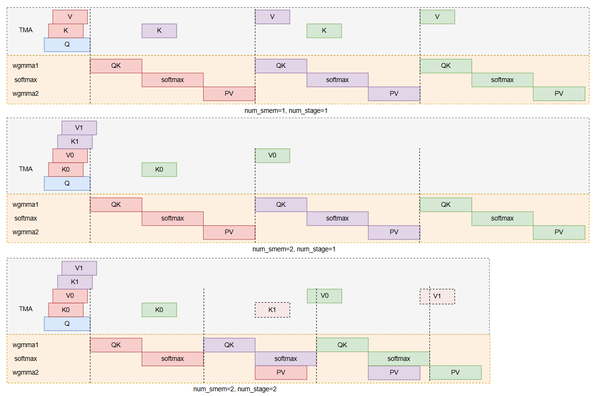

### 流水线图Load长于Compute

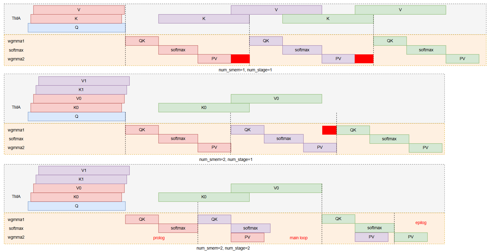

```c++
run_kernel<B=1,H=16,S=4096,D=64,BM=128,BN=128,threads=384, smem=1, stage=1>
  avg_time = 0.319 ms, throughput = 215.086 TFLOPS

run_kernel<B=1,H=16,S=4096,D=64,BM=128,BN=128,threads=384, smem=2, stage=1>
  avg_time = 0.242 ms, throughput = 283.750 TFLOPS

run_kernel<B=1,H=16,S=4096,D=64,BM=128,BN=128,threads=384, smem=2, stage=2>
  avg_time = 0.231 ms, throughput = 296.931 TFLOPS

run_kernel<B=1,H=16,S=4096,D=64,BM=128,BN=128,threads=384, smem=3, stage=2>
  avg_time = 0.239 ms, throughput = 288.102 TFLOPS
```

 - Q: 到底是TMA变长了，还是TMA指令延后了？

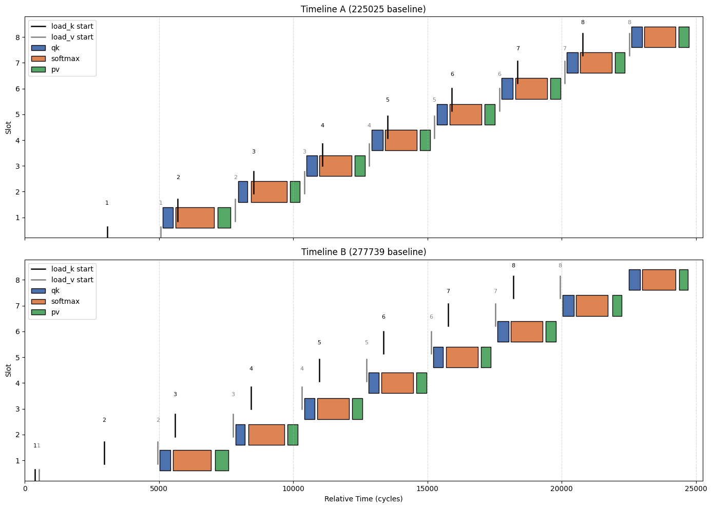

&emsp;&emsp;从图中可以看出tma并没有导致计算往后推，但是这个仅仅只是blockIDx==0时的一个block，因为profile结构体放在global，只能由一个block来写入才能保证正确性。我认为整体kernel性能提升16%，并不能体现在一个block记录的数据画的图上，性能提升需要综合考虑所有的block的来考虑。至于为什么tma_ws.cu也是使用一个block测的为什么它就有很大的tma波动且时间很长，这是因为那个kernel中没有计算，tma指令在一个block中也是连续的一次性发送s/bn次，这么这个波动很容易在一个block中体现出来，且它的grid中block本身也开得多。

**(6.4) 已经发现的现象：由于插入clock后，stage=1情况下，smem=1和2的时间没有明显区别，所有clock的插入明显影响了smem=2的性能优势。因此我去除了多余的clock，只记录上次迭代PV结束和这次迭代QK开始的clock，smem=2的性能优势得以体现。**
```c
// shape: (1, 16, 4096, 128) - 512个block - clock多
attnWSKernel<BM=128, BN=128, smem=1> avg kernel time over 200 runs: 3.684 ms
attnWSKernel<BM=128, BN=128, smem=2> avg kernel time over 200 runs: 3.688 ms
// shape: (1, 16, 4096, 128) - 512个block - clock少
attnWSKernel<BM=128, BN=128, smem=1> avg kernel time over 200 runs: 0.520 ms
attnWSKernel<BM=128, BN=128, smem=2> avg kernel time over 200 runs: 0.487 ms
// shape: (1, 16, 4096, 128) - 512个block - clock无
run_kernel<B=1,H=16,S=4096,D=128,BM=128,BN=128,threads=384, smem=1, stage=1>
  avg_time = 0.547 ms, throughput = 251.086 TFLOPS
run_kernel<B=1,H=16,S=4096,D=128,BM=128,BN=128,threads=384, smem=2, stage=1>
  avg_time = 0.445 ms, throughput = 309.022 TFLOPS
```

### smem1-stage1的kernel上次PV结束和这次迭代QK开始（DIM=128）
| slot | pv_end_abs | next_qk_start_abs | pv_end_rel | next_qk_start_rel | gap_cycles |
| ---: | ---: | ---: | ---: | ---: | ---: |
| 0 | 897633 | 897833 | 3304 | 3504 | 200 |
| 1 | 901136 | 901354 | 6807 | 7025 | 218 |
| 2 | 904512 | 904777 | 10183 | 10448 | 265 |
| 3 | 908060 | 908402 | 13731 | 14073 | 342 |
| 4 | 911659 | 911893 | 17330 | 17564 | 234 |
| 5 | 914945 | 915466 | 20616 | 21137 | 521 |
| 6 | 918746 | 918968 | 24417 | 24639 | 222 |
| 7 | 922064 | 922495 | 27735 | 28166 | 431 |
| 8 | 925778 | 925979 | 31449 | 31650 | 201 |


### smem2-stage1的kernel计时上次PV结束和这次迭代QK开始（DIM=128）
| slot | pv_end_abs | next_qk_start_abs | pv_end_rel | next_qk_start_rel | gap_cycles |
| ---: | ---: | ---: | ---: | ---: | ---: |
| 0 | 352341 | 352549 | 3292 | 3500 | 208 |
| 1 | 355631 | 355839 | 6582 | 6790 | 208 |
| 2 | 358780 | 358988 | 9731 | 9939 | 208 |
| 3 | 361931 | 362139 | 12882 | 13090 | 208 |
| 4 | 365100 | 365308 | 16051 | 16259 | 208 |
| 5 | 368255 | 368463 | 19206 | 19414 | 208 |
| 6 | 371415 | 371623 | 22366 | 22574 | 208 |
| 7 | 374575 | 374783 | 25526 | 25734 | 208 |
| 8 | 377728 | 377936 | 28679 | 28887 | 208 |

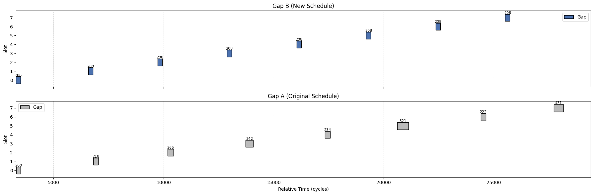

这个图可以凸显出开了双倍的buffer后，每次迭代变得更加紧凑了，由于DIM=128无法开三倍buffer，但从下面的数据可以看出2倍时gap已经趋于稳定。其实还可以测量softmax的结束和pv的开始之间的gap，该gap会受到v加载的影响而变宽（流水线图可以看出的两种可能产生性能损失的点）。因此间接说明tma长于softmax+pv的计算，这样我们将问题锁定在：

1. block越多，tma指令也越多，tma cycle越不稳定？

分析：同时只有可能有114个block(warp)处于执行状态，tma指令发射只有可能和kernel中发射的次数相关。因此无计算的kernel，tma指令发射根本没有停顿，数据一到，立马发tma，但是在shape小的时候没有受到影响，只有少部分有影响。当shape变大，block数增多，tma cycle明显变大波动。

2. SM个TMA请求，TMA能不能及时处理？

分析：测量串行attn的tma迭代波动，这个情况下不存在一个block发送非常频tma请求的情况，只存在不同block发射tma请求的情况，而且也只有可能是114个tma请求，串行的情况下，tma的指令是很分散的，TMA硬件就没有这么大的压力。所以我认为TMA只能接受处理地定量的tma请求，上述分析认为应该可以接受sm个数的请求而不会波动的，但是如果一个sm不止发一个tma请求，那么会产生波动和增大了，需要找到这个平衡点，到底TMA能接受多少请求。block我们无法控制，也就是哪怕kernel每次迭代只发1次tma请求，也只会有114次请求。我们可以控制每次迭代发射多少tma，以及多久迭代一次。我认为tma的波动增大是受到这两个因素的影响。

- 实验：测量shape:(1, 16, 4096, 128)下，同步attn kernel，调整设置grid的size，控制启动的block数量。
- 结果：

### BM=128, BN=128, grid={1, 1, 1} (1 block)
| slot | BM | BN | LoadK(avg) | LoadV(avg) |
| ---: | ---: | ---: | ---: | ---: |
| 0 | 128 | 128 | 808.00 | 729.00 |
| 1 | 128 | 128 | 691.00 | 683.00 |
| 2 | 128 | 128 | 693.00 | 680.00 |
| 3 | 128 | 128 | 689.00 | 685.00 |
| 4 | 128 | 128 | 691.00 | 675.00 |
| 5 | 128 | 128 | 693.00 | 677.00 |
| 6 | 128 | 128 | 690.00 | 677.00 |
| 7 | 128 | 128 | 689.00 | 679.00 |
| 8 | 128 | 128 | 688.00 | 676.00 |
| 9 | 128 | 128 | 681.00 | 682.00 |
| 10 | 128 | 128 | 687.00 | 677.00 |
| 11 | 128 | 128 | 689.00 | 682.00 |
| 12 | 128 | 128 | 688.00 | 675.00 |
| 13 | 128 | 128 | 684.00 | 676.00 |
| 14 | 128 | 128 | 688.00 | 672.00 |
| 15 | 128 | 128 | 696.00 | 678.00 |

### BM=128, BN=128, grid={1, 16, 7} (112 block)
| slot | BM | BN | LoadK(avg) | LoadV(avg) |
| ---: | ---: | ---: | ---: | ---: |
| 0 | 128 | 128 | 1028.00 | 1018.00 |
| 1 | 128 | 128 | 911.00 | 881.00 |
| 2 | 128 | 128 | 1014.00 | 992.00 |
| 3 | 128 | 128 | 1019.00 | 860.00 |
| 4 | 128 | 128 | 879.00 | 958.00 |
| 5 | 128 | 128 | 856.00 | 869.00 |
| 6 | 128 | 128 | 895.00 | 871.00 |
| 7 | 128 | 128 | 850.00 | 886.00 |
| 8 | 128 | 128 | 906.00 | 990.00 |
| 9 | 128 | 128 | 1066.00 | 1200.00 |
| 10 | 128 | 128 | 858.00 | 1047.00 |
| 11 | 128 | 128 | 1018.00 | 875.00 |
| 12 | 128 | 128 | 898.00 | 861.00 |
| 13 | 128 | 128 | 884.00 | 870.00 |
| 14 | 128 | 128 | 1029.00 | 981.00 |
| 15 | 128 | 128 | 1031.00 | 1008.00 |

在同步执行的attention kernel中，当只启动1个block时，KV的TMA稳定；当开启112个block时，KV的TMA增大且波动；实验证明，增大block会有tma指令的排队现象产生，导致实际tma时常波动增加。

现在我们提升block的数量，得到需要多少block才能出现tma指令执行时常波动和增加的情况。在有计算的情况下开15个block会出现波动情况，而在无计算的情况下，14个block就会出现波动的情况；实验证明，计算能减少或放缓tma指令发出，减少同时处于排队的tma指令。

### 有计算 BM=128, BN=128, grid={1, 15, 1} (15 block)
| slot | BM | BN | LoadK(avg) | LoadV(avg) |
| ---: | ---: | ---: | ---: | ---: |
| 0 | 128 | 128 | 1038.00 | 710.00 |
| 1 | 128 | 128 | 690.00 | 686.00 |
| 2 | 128 | 128 | 686.00 | 999.00 |
| 3 | 128 | 128 | 691.00 | 1006.00 |
| 4 | 128 | 128 | 919.00 | 659.00 |
| 5 | 128 | 128 | 801.00 | 665.00 |
| 6 | 128 | 128 | 688.00 | 667.00 |
| 7 | 128 | 128 | 686.00 | 679.00 |
| 8 | 128 | 128 | 1000.00 | 682.00 |
| 9 | 128 | 128 | 1048.00 | 675.00 |
| 10 | 128 | 128 | 696.00 | 679.00 |
| 11 | 128 | 128 | 699.00 | 680.00 |
| 12 | 128 | 128 | 941.00 | 677.00 |
| 13 | 128 | 128 | 741.00 | 678.00 |
| 14 | 128 | 128 | 704.00 | 676.00 |
| 15 | 128 | 128 | 692.00 | 673.00 |

### 无计算 BM=128, BN=128, grid={1, 14, 1} (14 block)

| slot | BM | BN | LoadK(avg) | LoadV(avg) |
| ---: | ---: | ---: | ---: | ---: |
| 0 | 128 | 128 | 787.00 | 934.00 |
| 1 | 128 | 128 | 785.00 | 915.00 |
| 2 | 128 | 128 | 712.00 | 1061.00 |
| 3 | 128 | 128 | 768.00 | 912.00 |
| 4 | 128 | 128 | 878.00 | 706.00 |
| 5 | 128 | 128 | 878.00 | 707.00 |
| 6 | 128 | 128 | 1077.00 | 709.00 |
| 7 | 128 | 128 | 855.00 | 707.00 |
| 8 | 128 | 128 | 904.00 | 717.00 |
| 9 | 128 | 128 | 941.00 | 704.00 |
| 10 | 128 | 128 | 1118.00 | 714.00 |
| 11 | 128 | 128 | 896.00 | 713.00 |
| 12 | 128 | 128 | 702.00 | 708.00 |
| 13 | 128 | 128 | 710.00 | 706.00 |
| 14 | 128 | 128 | 720.00 | 717.00 |
| 15 | 128 | 128 | 707.00 | 706.00 |

总结，实验证明，tma的波动与block数量以及循环内部是否有计算延迟TMA指令的发射都相关，且证明在sm未打满的情况下，也会出现tma波动的情况。


### attnWSKernel<BM=128, BN=128, DIM=64, smem=1>

| slot | pv_end_abs | next_qk_start_abs | pv_end_rel | next_qk_start_rel | gap_cycles |
| ---: | ---: | ---: | ---: | ---: | ---: |
| 0 | 292340 | 292550 | 2411 | 2621 | 210 |
| 1 | 294714 | 294927 | 4785 | 4998 | 213 |
| 2 | 297103 | 297331 | 7174 | 7402 | 228 |
| 3 | 299532 | 299764 | 9603 | 9835 | 232 |
| 4 | 301944 | 302175 | 12015 | 12246 | 231 |
| 5 | 304358 | 304569 | 14429 | 14640 | 211 |
| 6 | 306750 | 306963 | 16821 | 17034 | 213 |
| 7 | 309139 | 309361 | 19210 | 19432 | 222 |
| 8 | 311545 | 311773 | 21616 | 21844 | 228 |

### attnWSKernel<BM=128, BN=128, DIM=64, smem=2>

| slot | pv_end_abs | next_qk_start_abs | pv_end_rel | next_qk_start_rel | gap_cycles |
| ---: | ---: | ---: | ---: | ---: | ---: |
| 0 | 926225 | 926431 | 2428 | 2634 | 206 |
| 1 | 928593 | 928799 | 4796 | 5002 | 206 |
| 2 | 930962 | 931168 | 7165 | 7371 | 206 |
| 3 | 933396 | 933602 | 9599 | 9805 | 206 |
| 4 | 935779 | 935985 | 11982 | 12188 | 206 |
| 5 | 938162 | 938368 | 14365 | 14571 | 206 |
| 6 | 940545 | 940751 | 16748 | 16954 | 206 |
| 7 | 942928 | 943134 | 19131 | 19337 | 206 |
| 8 | 945313 | 945519 | 21516 | 21722 | 206 |

### attnWSKernel<BM=128, BN=128, DIM=64, smem=3>

| slot | pv_end_abs | next_qk_start_abs | pv_end_rel | next_qk_start_rel | gap_cycles |
| ---: | ---: | ---: | ---: | ---: | ---: |
| 0 | 281649 | 281855 | 2411 | 2617 | 206 |
| 1 | 284079 | 284285 | 4841 | 5047 | 206 |
| 2 | 286397 | 286603 | 7159 | 7365 | 206 |
| 3 | 288758 | 288964 | 9520 | 9726 | 206 |
| 4 | 291187 | 291393 | 11949 | 12155 | 206 |
| 5 | 293505 | 293711 | 14267 | 14473 | 206 |
| 6 | 295866 | 296072 | 16628 | 16834 | 206 |
| 7 | 298297 | 298503 | 19059 | 19265 | 206 |
| 8 | 300615 | 300821 | 21377 | 21583 | 206 |

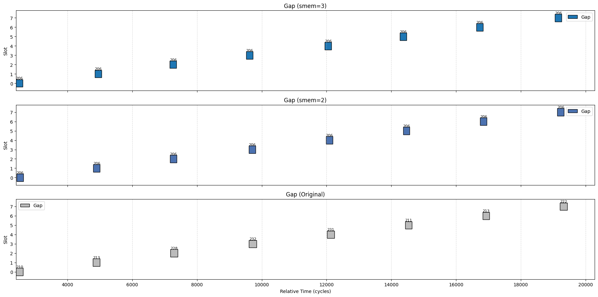

## 4.FA3测试信息

### Cmpute/Mem Throughput (FA3\Our_FA3\Tielang_FA3)

<!-- 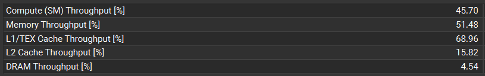
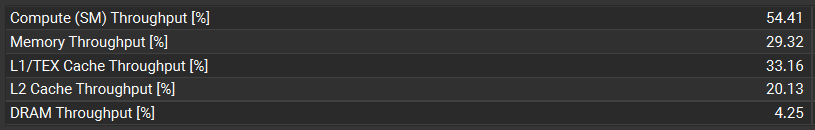
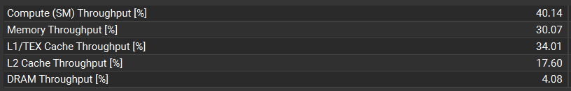 -->


### Tensor Core Utilization (FA3\Our_FA3\Tielang_FA3)

<td>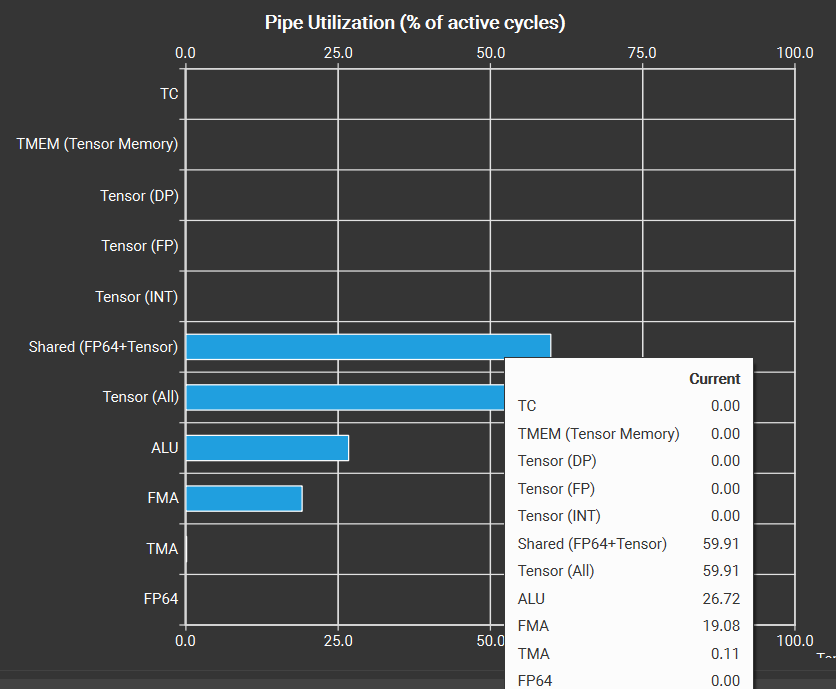</td>
<td>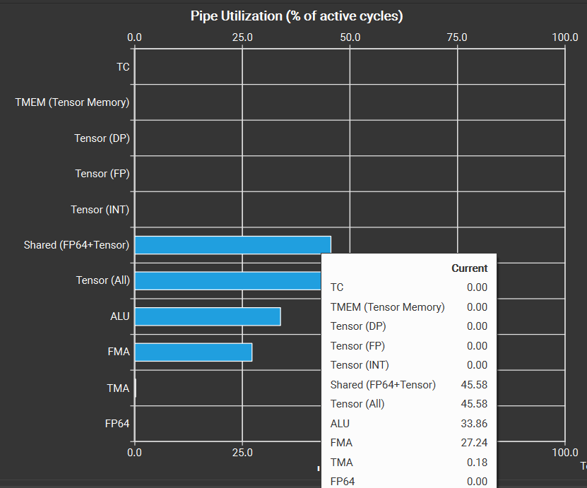</td>
<td>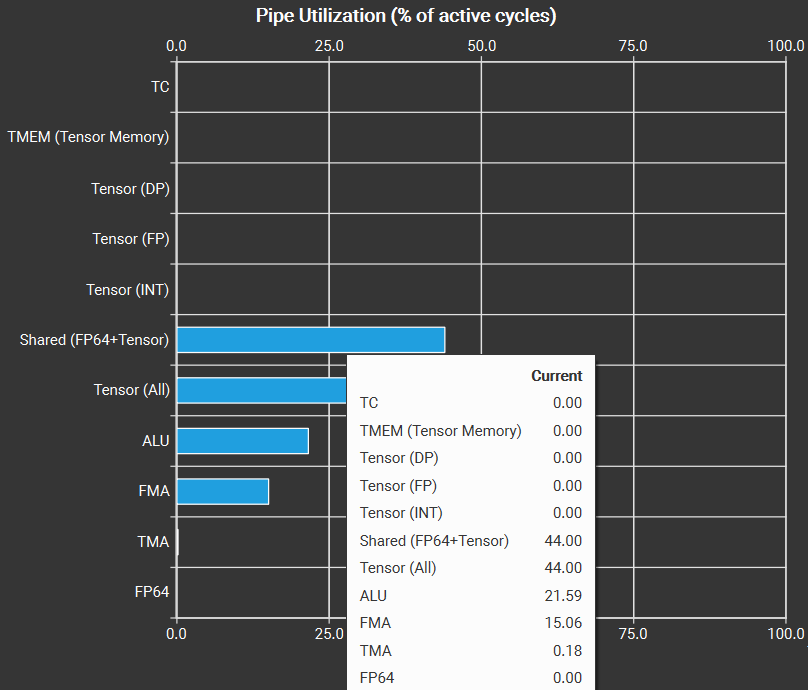</td>

<!-- 

 -->

