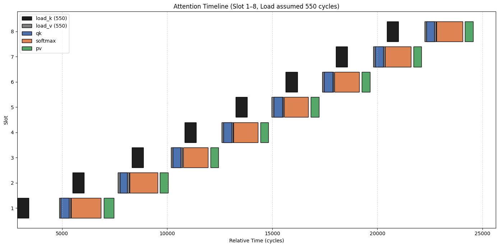
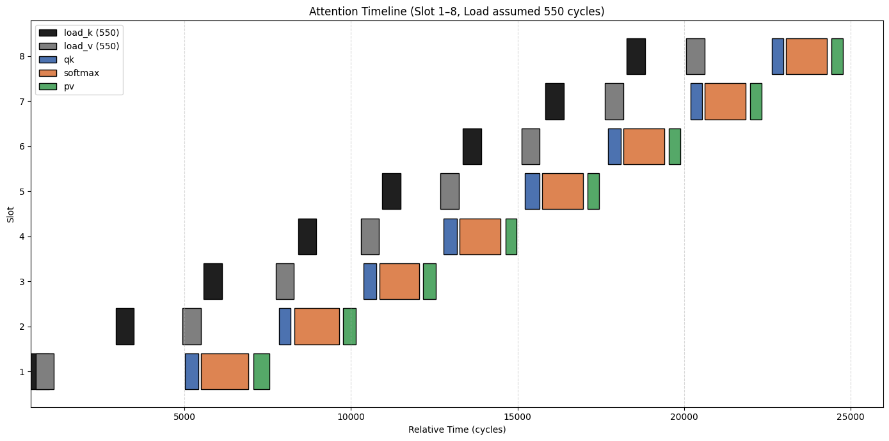

## 1. 同步 flash-attention
 - 说明：TMA、GEMM、Softmax 同步执行，未开启异步特性，分别测量各部分所消耗的时间
 - 测试方式：预热10次，执行100次，取均值，仅允许第一个block的第一个线程进行即时修改全局计时变量profile
 - 变量：BM、BN 为 tile 大小，B = 1, H = 1, S = 512, D = 128
 - 结果：

### 随着tile大小的变化各功能执行时间
| BM | BN | LoadQ(avg) | LoadK(avg) | LoadV(avg) | GEMM-QK(avg) | SOFTMAX(avg) | GEMM-PV(avg) |
| ---: | ---: | ---: | ---: | ---: | ---: | ---: | ---: |
| 128 | 32 | 615.06 | 463.38 | 427.58 | 233.03 | 682.69 | 168.00 |
| 128 | 64 | 615.11 | 500.15 | 475.93 | 285.09 | 943.66 | 261.00 |
| 128 | 128 | 616.35 | 553.74 | 543.87 | 527.90 | 1332.06 | 531.03 |
| 128 | 256 | 616.64 | 720.79 | 686.94 | 1144.94 | 2636.82 | 1043.08 |
| 256 | 32 | 768.65 | 451.85 | 436.45 | 552.34 | 872.65 | 268.00 |
| 256 | 64 | 770.71 | 490.29 | 462.49 | 745.97 | 1495.50 | 541.00 |
| 256 | 128 | 773.05 | 595.32 | 550.13 | 1222.74 | 2734.72 | 1073.03 |


数据已更新，之前的测量方式不准确，该数据更新于2026.6.3，测量方式修改为每次迭代记录周期时间戳，出kernel后再做计算，且每次迭代都存储在不同数组中。

**大于128/128的tile汇编器报警告了，可能该变了wgmma的指令执行，gemm值可能偏大**


### 将MMA_N的最大值限制为128

```c++
  // WGMMA指令计算size的设置方式
  constexpr int MMA_M = 64;
  constexpr int QK_MMA_N = BN <= 128 ? BN : 128;    // QK
  constexpr int PV_MMA_N = DIM <= 128 ? DIM : 128;  // PV
  constexpr int MMA_K = 16;
```

| BM | BN | LoadQ(avg) | LoadK(avg) | LoadV(avg) | GEMM-QK(avg) | SOFTMAX(avg) | GEMM-PV(avg) |
| ---: | ---: | ---: | ---: | ---: | ---: | ---: | ---: |
| 128 | 32 | 615.06 | 463.38 | 427.58 | 233.03 | 682.69 | 168.00 |
| 128 | 64 | 615.11 | 500.15 | 475.93 | 285.09 | 943.66 | 261.00 |
| 128 | 128 | 616.35 | 553.74 | 543.87 | 527.90 | 1332.06 | 531.03 |
| 128 | 256 | 616.64 | 720.79 | 686.94 | 1144.94 | 2636.82 | 1043.08 |
| 256 | 32 | 768.65 | 451.85 | 436.45 | 552.34 | 872.65 | 268.00 |
| 256 | 64 | 770.71 | 490.29 | 462.49 | 745.97 | 1495.50 | 541.00 |
| 256 | 128 | 773.05 | 595.32 | 550.13 | 1222.74 | 2734.72 | 1073.03 |

此处也进行了数据更新！


## 2. WS 模式下测量QKV的TMA Load
 - 说明：仅仅测量TMA在WS模式下的时间开销，xxx_rel是相对原点的周期数（用于刻画时间轴体现重叠）
 - 测试方式：预热10次，执行100次，取均值，仅允许第一个block的第一个线程进行即时修改全局计时变量profile
 - 变量：BM、BN 为 tile 大小，B = 1, H = 1, S = 512, D = 128
 - 结果：

### BM = 128, BN = 32

| op | slot | start_abs | end_abs | start_rel | end_rel | cycles |
| --- | ---: | ---: | ---: | ---: | ---: | ---: |
| Q | 0 | 9928 | 810 | 0 | 882 | 882 |
| K | 0 | 231 | 985 | 303 | 1057 | 754 |
| V | 0 | 414 | 1109 | 486 | 1181 | 695 |
| K | 1 | 1126 | 1576 | 1198 | 1648 | 450 |
| V | 1 | 1278 | 1712 | 1350 | 1784 | 434 |
| K | 2 | 1734 | 2184 | 1806 | 2256 | 450 |
| V | 2 | 1879 | 2320 | 1951 | 2392 | 441 |
| K | 3 | 2344 | 2808 | 2416 | 2880 | 464 |
| V | 3 | 2504 | 2944 | 2576 | 3016 | 440 |
| K | 4 | 2967 | 3434 | 3039 | 3506 | 467 |
| V | 4 | 3127 | 3570 | 3199 | 3642 | 443 |
| K | 5 | 3593 | 4060 | 3665 | 4132 | 467 |
| V | 5 | 3754 | 4196 | 3826 | 4268 | 442 |
| K | 6 | 4219 | 4679 | 4291 | 4751 | 460 |
| V | 6 | 4379 | 4815 | 4451 | 4887 | 436 |
| K | 7 | 4839 | 5302 | 4911 | 5374 | 463 |
| V | 7 | 4999 | 5438 | 5071 | 5510 | 439 |
| K | 8 | 5461 | 5926 | 5533 | 5998 | 465 |
| V | 8 | 5622 | 6062 | 5694 | 6134 | 440 |
| K | 9 | 6085 | 6547 | 6157 | 6619 | 462 |
| V | 9 | 6245 | 6683 | 6317 | 6755 | 438 |
| K | 10 | 6706 | 7168 | 6778 | 7240 | 462 |
| V | 10 | 6862 | 7304 | 6934 | 7376 | 442 |
| K | 11 | 7328 | 7793 | 7400 | 7865 | 465 |
| V | 11 | 7488 | 7929 | 7560 | 8001 | 441 |
| K | 12 | 7951 | 8406 | 8023 | 8478 | 455 |
| V | 12 | 8096 | 8542 | 8168 | 8614 | 446 |
| K | 13 | 8565 | 9032 | 8637 | 9104 | 467 |
| V | 13 | 8726 | 9168 | 8798 | 9240 | 442 |
| K | 14 | 9192 | 9657 | 9264 | 9729 | 465 |
| V | 14 | 9352 | 9793 | 9424 | 9865 | 441 |
| K | 15 | 9817 | 280 | 9889 | 10352 | 463 |
| V | 15 | 9977 | 411 | 10049 | 10483 | 434 |


### BM = 128, BN = 64

| op | slot | start_abs | end_abs | start_rel | end_rel | cycles |
| --- | ---: | ---: | ---: | ---: | ---: | ---: |
| Q | 0 | 3595 | 4487 | 0 | 892 | 892 |
| K | 0 | 3899 | 4660 | 304 | 1065 | 761 |
| V | 0 | 4082 | 4788 | 487 | 1193 | 706 |
| K | 1 | 4811 | 5364 | 1216 | 1769 | 553 |
| V | 1 | 4965 | 5502 | 1370 | 1907 | 537 |
| K | 2 | 5525 | 6099 | 1930 | 2504 | 574 |
| V | 2 | 5686 | 6235 | 2091 | 2640 | 549 |
| K | 3 | 6258 | 6813 | 2663 | 3218 | 555 |
| V | 3 | 6418 | 6949 | 2823 | 3354 | 531 |
| K | 4 | 6972 | 7545 | 3377 | 3950 | 573 |
| V | 4 | 7135 | 7683 | 3540 | 4088 | 548 |
| K | 5 | 7706 | 8260 | 4111 | 4665 | 554 |
| V | 5 | 7866 | 8398 | 4271 | 4803 | 532 |
| K | 6 | 8420 | 8985 | 4825 | 5390 | 565 |
| V | 6 | 8565 | 9121 | 4970 | 5526 | 556 |
| K | 7 | 9144 | 9710 | 5549 | 6115 | 566 |
| V | 7 | 9305 | 9841 | 5710 | 6246 | 536 |


### BM = 128, BN = 128

| op | slot | start_abs | end_abs | start_rel | end_rel | cycles |
| --- | ---: | ---: | ---: | ---: | ---: | ---: |
| Q | 0 | 5501 | 6362 | 0 | 861 | 861 |
| K | 0 | 5805 | 6684 | 304 | 1183 | 879 |
| V | 0 | 5988 | 6893 | 487 | 1392 | 905 |
| K | 1 | 6847 | 7550 | 1346 | 2049 | 703 |
| V | 1 | 7003 | 7816 | 1502 | 2315 | 813 |
| K | 2 | 7713 | 8396 | 2212 | 2895 | 683 |
| V | 2 | 7927 | 8666 | 2426 | 3165 | 739 |
| K | 3 | 8559 | 9301 | 3058 | 3800 | 742 |
| V | 3 | 8777 | 9531 | 3276 | 4030 | 754 |


### BM = 128, BN = 256

| op | slot | start_abs | end_abs | start_rel | end_rel | cycles |
| --- | ---: | ---: | ---: | ---: | ---: | ---: |
| Q | 0 | 6421 | 7319 | 0 | 898 | 898 |
| K | 0 | 6725 | 7991 | 304 | 1570 | 1266 |
| V | 0 | 6908 | 8421 | 487 | 2000 | 1513 |
| K | 1 | 8154 | 9188 | 1733 | 2767 | 1034 |
| V | 1 | 8532 | 9722 | 2111 | 3301 | 1190 |


### BM = 256, BN = 32

| op | slot | start_abs | end_abs | start_rel | end_rel | cycles |
| --- | ---: | ---: | ---: | ---: | ---: | ---: |
| Q | 0 | 6739 | 7915 | 0 | 1176 | 1176 |
| K | 0 | 7043 | 8092 | 304 | 1353 | 1049 |
| V | 0 | 7226 | 8216 | 487 | 1477 | 990 |
| K | 1 | 8233 | 8686 | 1494 | 1947 | 453 |
| V | 1 | 8385 | 8822 | 1646 | 2083 | 437 |
| K | 2 | 8846 | 9307 | 2107 | 2568 | 461 |
| V | 2 | 9006 | 9443 | 2267 | 2704 | 437 |
| K | 3 | 9467 | 9930 | 2728 | 3191 | 463 |
| V | 3 | 9627 | 66 | 2888 | 3327 | 439 |
| K | 4 | 88 | 540 | 3349 | 3801 | 452 |
| V | 4 | 233 | 676 | 3494 | 3937 | 443 |
| K | 5 | 699 | 1162 | 3960 | 4423 | 463 |
| V | 5 | 859 | 1298 | 4120 | 4559 | 439 |
| K | 6 | 1321 | 1782 | 4582 | 5043 | 461 |
| V | 6 | 1482 | 1918 | 4743 | 5179 | 436 |
| K | 7 | 1942 | 2408 | 5203 | 5669 | 466 |
| V | 7 | 2102 | 2544 | 5363 | 5805 | 442 |
| K | 8 | 2567 | 3032 | 5828 | 6293 | 465 |
| V | 8 | 2728 | 3168 | 5989 | 6429 | 440 |
| K | 9 | 3191 | 3658 | 6452 | 6919 | 467 |
| V | 9 | 3352 | 3794 | 6613 | 7055 | 442 |
| K | 10 | 3817 | 4281 | 7078 | 7542 | 464 |
| V | 10 | 3978 | 4417 | 7239 | 7678 | 439 |
| K | 11 | 4440 | 4905 | 7701 | 8166 | 465 |
| V | 11 | 4601 | 5041 | 7862 | 8302 | 440 |
| K | 12 | 5064 | 5530 | 8325 | 8791 | 466 |
| V | 12 | 5225 | 5666 | 8486 | 8927 | 441 |
| K | 13 | 5689 | 6153 | 8950 | 9414 | 464 |
| V | 13 | 5850 | 6289 | 9111 | 9550 | 439 |
| K | 14 | 6312 | 6779 | 9573 | 10040 | 467 |
| V | 14 | 6473 | 6915 | 9734 | 10176 | 442 |
| K | 15 | 6938 | 7404 | 10199 | 10665 | 466 |
| V | 15 | 7099 | 7535 | 10360 | 10796 | 436 |


### BM = 256, BN = 64

| op | slot | start_abs | end_abs | start_rel | end_rel | cycles |
| --- | ---: | ---: | ---: | ---: | ---: | ---: |
| Q | 0 | 8251 | 9458 | 0 | 1207 | 1207 |
| K | 0 | 8555 | 9631 | 304 | 1380 | 1076 |
| V | 0 | 8738 | 9755 | 487 | 1504 | 1017 |
| K | 1 | 9772 | 329 | 1521 | 2078 | 557 |
| V | 1 | 9924 | 465 | 1673 | 2214 | 541 |
| K | 2 | 488 | 1048 | 2237 | 2797 | 560 |
| V | 2 | 649 | 1186 | 2398 | 2935 | 537 |
| K | 3 | 1210 | 1771 | 2959 | 3520 | 561 |
| V | 3 | 1370 | 1909 | 3119 | 3658 | 539 |
| K | 4 | 1931 | 2488 | 3680 | 4237 | 557 |
| V | 4 | 2076 | 2624 | 3825 | 4373 | 548 |
| K | 5 | 2647 | 3206 | 4396 | 4955 | 559 |
| V | 5 | 2808 | 3342 | 4557 | 5091 | 534 |
| K | 6 | 3364 | 3902 | 5113 | 5651 | 538 |
| V | 6 | 3509 | 4040 | 5258 | 5789 | 531 |
| K | 7 | 4063 | 4618 | 5812 | 6367 | 555 |
| V | 7 | 4224 | 4751 | 5973 | 6500 | 527 |


### BM = 256, BN = 128

| op | slot | start_abs | end_abs | start_rel | end_rel | cycles |
| --- | ---: | ---: | ---: | ---: | ---: | ---: |
| Q | 0 | 5842 | 7049 | 0 | 1207 | 1207 |
| K | 0 | 6146 | 7369 | 304 | 1527 | 1223 |
| V | 0 | 6329 | 7528 | 487 | 1686 | 1199 |
| K | 1 | 7532 | 8284 | 1690 | 2442 | 752 |
| V | 1 | 7697 | 8531 | 1855 | 2689 | 834 |
| K | 2 | 8447 | 9144 | 2605 | 3302 | 697 |
| V | 2 | 8638 | 9399 | 2796 | 3557 | 761 |
| K | 3 | 9307 | 9995 | 3465 | 4153 | 688 |
| V | 3 | 9506 | 263 | 3664 | 4421 | 757 |


## 3.FA3的Num_Buffer和Num_Stage可调整

### 测试 shape=(1, 16, 4096, 64) tile=(128, 128)含 NCU 测量的计算/访存吞吐

| name | smem | stage | time(ms) | tflops | SM Throughput | Mem Throughput | L2 Cache Rate(%) | Theoretical Occupancy(%) | Achieved Occupancy(%) | 
| --- | --- | ---: | ---: | ---: | ---: | ---: | ---: | ---: | ---: |
| K1 | 1 | 1 | 0.319 | 215.086 | 40.22 | 22.90 | 87.64 | 18.75 | 13.92 |
| K2 | 2 | 1 | 0.242 | 283.750 | 50.65 | 27.86 | 81.00 | 18.75 | 13.86 |
| K3 | 2 | 2 | 0.231 | 296.931 | 53.61 | 28.81 | 92.43 | 18.75 | 13.90 |
| K4 | 3 | 2 | 0.239 | 288.102 | 52.87 | 28.35 | 85.11 | 18.75 | 13.86 |

&emsp;&emsp;结合吞吐率、缓存命中率和 occupancy 信息来看，这组实验可以总结为：当前 kernel 的性能提升主要来自 producer-consumer 流水线重叠程度的改善，而不是 occupancy 提升或全局内存带宽提升。K1 使用 num_smem=1, num_stage=1 时，执行时间为 0.319 ms，性能只有 215.086 TFLOPS，SM Throughput 为 40.22%，Mem Throughput 为 22.90%，说明此时计算单元和内存子系统的利用率都不高，kernel 很可能存在明显的 load/compute 串行等待；由于只有一个 shared memory buffer，producer 加载下一块数据和 consumer 使用当前数据进行 WGMMA 计算之间难以重叠，导致 SM 上虽然有 active warp，但很多时候 warp 处于等待 TMA、barrier 或 WGMMA 数据依赖的状态，计算管线没有被充分填满。

&emsp;&emsp;当配置变为 K2，即 num_smem=2, num_stage=1 后，时间从 0.319 ms 降到 0.242 ms，TFLOPS 从 215.086 提升到 283.750，提升约 31.9%；同时 SM Throughput 从 40.22% 提升到 50.65%，Mem Throughput 从 22.90% 提升到 27.86%。这说明双 shared memory buffer 显著改善了数据加载和计算之间的重叠：一个 buffer 可以供 consumer 执行 WGMMA，另一个 buffer 则由 producer 提前加载下一阶段数据，从而减少 consumer 等待数据的时间。这里 Mem Throughput 也有所上升，但绝对值仍然只有 27.86%，并不高，说明性能提升并不是因为打满了内存带宽，而是因为流水线更顺畅，使得 SM 计算单元能够更持续地工作。

&emsp;&emsp;进一步看 K3，num_smem=2, num_stage=2 时，时间继续下降到 0.231 ms，性能达到 296.931 TFLOPS，是四组配置中最高的；SM Throughput 提升到 53.61%，Mem Throughput 提升到 28.81%，L2 Cache Rate 也达到最高的 92.43%。这说明在双 buffer 已经解决主要数据供给问题之后，增加 WGMMA pipeline stage 仍然可以进一步隐藏一部分异步计算、同步或数据准备延迟，使得 WGMMA 指令流更加连续，SM 利用率进一步提高。不过 K2 到 K3 的提升幅度只有约 4.6%，明显小于 K1 到 K2，说明主要瓶颈已经通过双 buffer 得到缓解，增加 stage 只是进一步优化局部流水线效率。

&emsp;&emsp;而 K4 使用 num_smem=3, num_stage=2 后，性能反而下降：时间从 K3 的 0.231 ms 增加到 0.239 ms，TFLOPS 从 296.931 降到 288.102，SM Throughput 也从 53.61% 降到 52.87%，Mem Throughput 从 28.81% 略降到 28.35%，L2 Cache Rate 也从 92.43% 降到 85.11%。这说明继续增加 shared memory buffer 到 3 并没有带来更有效的 load/compute overlap，反而引入了额外开销，例如更多 shared memory 占用、更复杂的 buffer index 轮转、mbarrier 管理、地址计算以及可能更长的寄存器 live range。由于当前 Mem Throughput 本身并不高，全局内存或 L2 带宽并不是主要瓶颈，因此增加更多 smem buffer 无法带来明显收益。

&emsp;&emsp;另外，四组实验的 Theoretical Occupancy 都是 18.75%，Achieved Occupancy 也几乎保持在 13.86% 到 13.92% 之间，说明这些配置的性能差异并不是由 occupancy 改变造成的。换句话说，kernel 在四种配置下的驻留能力基本相同，都是比较低 occupancy 的 Hopper WGMMA kernel；真正决定性能差异的是在相同 occupancy 下，producer/consumer 的协同效率、WGMMA stage 的重叠程度，以及 warp 是否能持续成为 eligible 状态。K3 的 SM Throughput 最高，说明它在当前资源限制下让计算管线保持了最好的忙碌程度；而 K4 虽然 buffer 更多，但额外资源和同步开销抵消了潜在收益。

 - Q: 为什么k4的性能相较于k3会有所下降？

**K4 性能下降 = Shared Memory 占用 ↑ → L2 驻留质量 ↓ → 少量额外 L2 miss**

&emsp;&emsp;K4 的 L2 Cache Hit Rate 从 92.43% 降到 85.11%，是因为 3× shared buffer 增大了每个 ThreadBlock 的 SMEM 占用，间接压缩了 L2/片上缓存中 K/V tile 的有效驻留空间或加速其驱逐；由于 2× buffer（K3）已完全隐藏 TMA 延迟，第 3 个 buffer 无法减少 stall，却带来了 L2 hit 率下降引起的微小额外显存访问延迟，这就是 K4 性能略低于 K3 的直接微观架构原因。

 - Q: L2 Cache的命中率为什么会呈现出这样的变化？

**不同 CTA / 不同时间点读取 K/V tile 时，这些 tile 是否还在 L2 中**

&emsp;&emsp;K3改变了计算的顺序，CTA 间对 K/V 的访问节奏更一致，L2 复用窗口更好。K4更深的 buffer 没有提高 overlap，反而拉长了 K/V 的驻留距离，破坏了 L2 时间局部性。

&emsp;&emsp;L2 Cache 命中率变化，本质上来自 K/V tile 在不同 CTA 之间的 L2 复用窗口变化：K1 单缓冲节奏慢，命中率看起来还可以但性能差；K2 双缓冲让 TMA 更流式，性能升高但 L2 hit 降低；K3 的 2-stage 计算重排让 K/V 访问节奏更集中，所以 L2 hit 和性能同时最好；K4 三缓冲预取过深、smem footprint 过大，拉长了 load 到 consume 的距离，破坏了 L2 时间局部性，因此 L2 hit 回落。


### 流水线图Load短于Compute


### 流水线图Load长于Compute


```c++
run_kernel<B=1,H=16,S=4096,D=64,BM=128,BN=128,threads=384, smem=1, stage=1>
  avg_time = 0.319 ms, throughput = 215.086 TFLOPS

run_kernel<B=1,H=16,S=4096,D=64,BM=128,BN=128,threads=384, smem=2, stage=1>
  avg_time = 0.242 ms, throughput = 283.750 TFLOPS

run_kernel<B=1,H=16,S=4096,D=64,BM=128,BN=128,threads=384, smem=2, stage=2>
  avg_time = 0.231 ms, throughput = 296.931 TFLOPS

run_kernel<B=1,H=16,S=4096,D=64,BM=128,BN=128,threads=384, smem=3, stage=2>
  avg_time = 0.239 ms, throughput = 288.102 TFLOPS
```

 - Q: 到底是TMA边长了，还是TMA指令延后了？

### smem1-stage1的kernel计时load-kv的起点以及其他计算的起点、终点和时长

| op | slot | start_abs | end_abs | start_rel | end_rel | cycles |
| --- | ---: | ---: | ---: | ---: | ---: | ---: |
| load_k | 0 | 385621 | - | 0 | - | - |
| load_v | 0 | 385764 | - | 143 | - | - |
| qk | 0 | 387698 | 388283 | 2077 | 2662 | 585 |
| softmax | 0 | 388361 | 389897 | 2740 | 4276 | 1536 |
| pv | 0 | 390018 | 390341 | 4397 | 4720 | 323 |
| load_k | 1 | 388489 | - | 2868 | - | - |
| load_v | 1 | 390484 | - | 4863 | - | - |
| qk | 1 | 390557 | 390952 | 4936 | 5331 | 395 |
| softmax | 1 | 391043 | 392464 | 5422 | 6843 | 1421 |
| pv | 1 | 392611 | 393088 | 6990 | 7467 | 477 |
| load_k | 2 | 391122 | - | 5501 | - | - |
| load_v | 2 | 393264 | - | 7643 | - | - |
| qk | 2 | 393369 | 393714 | 7748 | 8093 | 345 |
| softmax | 2 | 393841 | 395164 | 8220 | 9543 | 1323 |
| pv | 2 | 395279 | 395659 | 9658 | 10038 | 380 |
| load_k | 3 | 393940 | - | 8319 | - | - |
| load_v | 3 | 395802 | - | 10181 | - | - |
| qk | 3 | 395891 | 396266 | 10270 | 10645 | 375 |
| softmax | 3 | 396381 | 397564 | 10760 | 11943 | 1183 |
| pv | 3 | 397678 | 398051 | 12057 | 12430 | 373 |
| load_k | 4 | 396456 | - | 10835 | - | - |
| load_v | 4 | 398209 | - | 12588 | - | - |
| qk | 4 | 398290 | 398697 | 12669 | 13076 | 407 |
| softmax | 4 | 398780 | 399944 | 13159 | 14323 | 1164 |
| pv | 4 | 400059 | 400442 | 14438 | 14821 | 383 |
| load_k | 5 | 398878 | - | 13257 | - | - |
| load_v | 5 | 400596 | - | 14975 | - | - |
| qk | 5 | 400683 | 401103 | 15062 | 15482 | 420 |
| softmax | 5 | 401181 | 402339 | 15560 | 16718 | 1158 |
| pv | 5 | 402454 | 402837 | 16833 | 17216 | 383 |
| load_k | 6 | 401262 | - | 15641 | - | - |
| load_v | 6 | 402991 | - | 17370 | - | - |
| qk | 6 | 403079 | 403499 | 17458 | 17878 | 420 |
| softmax | 6 | 403574 | 404766 | 17953 | 19145 | 1192 |
| pv | 6 | 404883 | 405271 | 19262 | 19650 | 388 |
| load_k | 7 | 403649 | - | 18028 | - | - |
| load_v | 7 | 405431 | - | 19810 | - | - |
| qk | 7 | 405515 | 405901 | 19894 | 20280 | 386 |
| softmax | 7 | 405992 | 407227 | 20371 | 21606 | 1235 |
| pv | 7 | 407343 | 407723 | 21722 | 22102 | 380 |
| load_k | 8 | 406075 | - | 20454 | - | - |
| load_v | 8 | 407865 | - | 22244 | - | - |
| qk | 8 | 407951 | 408322 | 22330 | 22701 | 371 |
| softmax | 8 | 408434 | 409673 | 22813 | 24052 | 1239 |
| pv | 8 | 409789 | 410169 | 24168 | 24548 | 380 |



### smem2-stage1的kernel计时load-kv的起点以及其他计算的起点、终点和时长

| op | slot | start_abs | end_abs | start_rel | end_rel | cycles |
| --- | ---: | ---: | ---: | ---: | ---: | ---: |
| load_k | 0 | 903247 | - | 0 | - | - |
| load_v | 0 | 903390 | - | 143 | - | - |
| qk | 0 | 905390 | 905975 | 2143 | 2728 | 585 |
| softmax | 0 | 906050 | 907599 | 2803 | 4352 | 1549 |
| pv | 0 | 907719 | 908041 | 4472 | 4794 | 322 |
| load_k | 1 | 903632 | - | 385 | - | - |
| load_v | 1 | 903775 | - | 528 | - | - |
| qk | 1 | 908255 | 908657 | 5008 | 5410 | 402 |
| softmax | 1 | 908748 | 910165 | 5501 | 6918 | 1417 |
| pv | 1 | 910312 | 910805 | 7065 | 7558 | 493 |
| load_k | 2 | 906178 | - | 2931 | - | - |
| load_v | 2 | 908182 | - | 4935 | - | - |
| qk | 2 | 911086 | 911431 | 7839 | 8184 | 345 |
| softmax | 2 | 911556 | 912890 | 8309 | 9643 | 1334 |
| pv | 2 | 913005 | 913385 | 9758 | 10138 | 380 |
| load_k | 3 | 908827 | - | 5580 | - | - |
| load_v | 3 | 910981 | - | 7734 | - | - |
| qk | 3 | 913628 | 914015 | 10381 | 10768 | 387 |
| softmax | 3 | 914106 | 915290 | 10859 | 12043 | 1184 |
| pv | 3 | 915404 | 915798 | 12157 | 12551 | 394 |
| load_k | 4 | 911656 | - | 8409 | - | - |
| load_v | 4 | 913544 | - | 10297 | - | - |
| qk | 4 | 916020 | 916435 | 12773 | 13188 | 415 |
| softmax | 4 | 916514 | 917728 | 13267 | 14481 | 1214 |
| pv | 4 | 917888 | 918218 | 14641 | 14971 | 330 |
| load_k | 5 | 914181 | - | 10934 | - | - |
| load_v | 5 | 915930 | - | 12683 | - | - |
| qk | 5 | 918474 | 918911 | 15227 | 15664 | 437 |
| softmax | 5 | 918994 | 920216 | 15747 | 16969 | 1222 |
| pv | 5 | 920349 | 920691 | 17102 | 17444 | 342 |
| load_k | 6 | 916607 | - | 13360 | - | - |
| load_v | 6 | 918363 | - | 15116 | - | - |
| qk | 6 | 920960 | 921346 | 17713 | 18099 | 386 |
| softmax | 6 | 921429 | 922656 | 18182 | 19409 | 1227 |
| pv | 6 | 922789 | 923131 | 19542 | 19884 | 342 |
| load_k | 7 | 919086 | - | 15839 | - | - |
| load_v | 7 | 920872 | - | 17625 | - | - |
| qk | 7 | 923447 | 923785 | 20200 | 20538 | 338 |
| softmax | 7 | 923868 | 925095 | 20621 | 21848 | 1227 |
| pv | 7 | 925228 | 925570 | 21981 | 22323 | 342 |
| load_k | 8 | 921521 | - | 18274 | - | - |
| load_v | 8 | 923308 | - | 20061 | - | - |
| qk | 8 | 925888 | 926226 | 22641 | 22979 | 338 |
| softmax | 8 | 926309 | 927536 | 23062 | 24289 | 1227 |
| pv | 8 | 927669 | 928011 | 24422 | 24764 | 342 |

